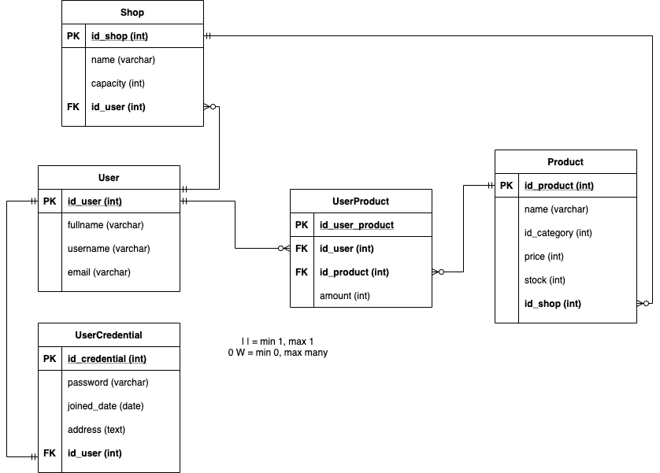

# Contoh Skema Database

## ONE TO ONE

EMPLOYEE

| id_employee | name      | gender | age  |
| ----------- | --------- | ------ | ---- |
| 1           | sofyan    | male   | 28   |
| 2           | jose      | male   | 25   |
| 4           | gabriella | female | 30   |

SALARY

| id   | jumlah_salary | id_employee |
| ---- | ------------- | ----------- |
| 3    | 5000000       | 2           |
| 4    | 2000000       | 4           |

KTP

| id_ktp | no_ktp           | id_employee |
| ------ | ---------------- | ----------- |
| 1      | 2378237487824545 | 1           |
| 2      | 9834757384737845 | 2           |
| 3      | 8383466345737457 | 3           |

## ONE TO MANY

PROJECT

| id_project | name                    | deadline  | price  |
| ---------- | ----------------------- | --------- | ------ |
| 1          | Sistem Informasi Gudang | 2020-8-31 | 280000 |
| 2          | Game 3D                 | 2021-5-3  | 250000 |
| 3          | Server Cloud            | 2030-6-1  | 300000 |

FITUR

| id   | name                | status   | id_project |
| ---- | ------------------- | -------- | ---------- |
| 1    | login gudang        | done     | 1          |
| 2    | logout gudang       | progress | 1          |
| 3    | spawn player        | start    | 2          |
| 4    | game over dashboard | done     | 2          |
| 5    | GCP                 | done     | 3          |
| 6    | AWS                 | start    | 3          |
| 7    | Hosting             | done     | 3          |
| 8    | CPanel              | progress | 3          |
| 9    | Billing             | progress | 3          |
| 10   | Dashboard           | start    | 1          |

PERSON

| id_person | name      | gender | age  |
| --------- | --------- | ------ | ---- |
| 1         | sofyan    | male   | 28   |
| 2         | jose      | male   | 25   |
| 3         | gabriella | female | 30   |

BARANG / INVENTARIS

| id_barang | nama_barang | jumlah | id_person |
| --------- | ----------- | ------ | --------- |
| 1         | baju        | 10     | 1         |
| 2         | sepatu      | 2      | 2         |
| 3         | mobil       | 1      | 1         |
| 4         | tas         | 1      | 3         |
| 5         | hp android  | 1      | 1         |
| 6         | hp apple    | 2      | 2         |

## MANY TO MANY

EMPLOYEE

| id_employee | name      | gender | age  |
| ----------- | --------- | ------ | ---- |
| 1           | sofyan    | male   | 28   |
| 2           | jose      | male   | 25   |
| 4           | gabriella | female | 30   |

EMPLOYEE FEATURE

| id_employee_feature | id_employee | id_feature |
| ------------------- | ----------- | ---------- |
| 1                   | 1           | 1          |
| 2                   | 1           | 10         |
| 3                   | 1           | 4          |
| 4                   | 2           | 1          |
| 5                   | 4           | 4          |
| 6                   | 4           | 6          |
| 7                   | 4           | 3          |

FITUR

| id   | name                | status   | id_project |
| ---- | ------------------- | -------- | ---------- |
| 1    | login gudang        | done     | 1          |
| 2    | logout gudang       | progress | 1          |
| 3    | spawn player        | start    | 2          |
| 4    | game over dashboard | done     | 2          |
| 5    | GCP                 | done     | 3          |
| 6    | AWS                 | start    | 3          |
| 7    | Hosting             | done     | 3          |
| 8    | CPanel              | progress | 3          |
| 9    | Billing             | progress | 3          |
| 10   | Dashboard           | start    | 1          |

------

Employee mengerjakan Features:

- sofyan mengerjakan
  - login gudang
  - dashboard
  - game over dashboard
- jose
  - login gudang
  - Hosting
- Gabriella
  - game over dashboard
  - AWS
  - spawn player

## Contoh skema dengan Draw.io

